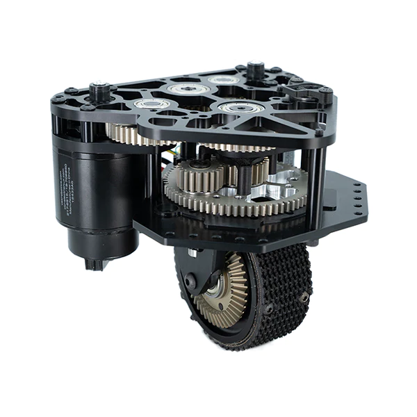

########
Hardware
########

Having a good swerve starts with having good hardware. Here is a short summary of 
potential swerve hardware you might use. 

Modules: 
********

Swerve Drive Specialties:
=========================

* `MK4 Module <https://www.swervedrivespecialties.com/products/mk4-swerve-module>`_

  * Cost (not including motors): $300-310 USD

  * Weight (with motors): 2.2 kg (Neo), 2.4 kg (Falcon)

  * Notable Features: Very robust and used widely among FRC teams

* `MK4i Module <https://www.swervedrivespecialties.com/collections/kits/products/mk4i-swerve-module>`_

  * Cost (not including motors): $365 USD

  * Weight (including motors): 2.7 kg (Neo), 2.9 kg (Falcon)

  * Notable Features: Compact, robust, and popular among FRC teams

.. list-table:: 

    * - .. figure:: ../Photos/Hardware/MK4.webp
            :alt: MK4 Swerve Module Image
            :target: https://www.swervedrivespecialties.com/collections/kits/products/mk4-swerve-module
            :scale: 30%

            MK4 Swerve Module

      - .. figure:: ../Photos/Hardware/MK4i.webp
            :alt: MK4i Swerve Module Image
            :target: https://www.swervedrivespecialties.com/collections/kits/products/mk4i-swerve-module
            :scale: 30%

            MK4i Swerve Module

West Coast Products: 
====================

* `Swerve X <https://wcproducts.com/products/swerve-x>`_

  * Cost (not including motors): $305-325 USD

  * Weight (not including motors): 1.2-1.6 kg (depends on the model)

  * Notable Features: Very configurable, many different options to choose from

    Possible Swerve X Configuration

REV Robotics: 
=============

* `MAXSwerve <https://www.revrobotics.com/pre-order-rev-21-3005/>`_

  * Cost (not including motors): $300 USD

  * Weight (including motors): 1.7 kg (Neo), 1.8 kg (Falcon)

  * Notable Features: Incredibly small and lightweight

.. figure:: ../Photos/Hardware/MAXSwerve.webp
    :alt: Image of MAXSwerve
    :target: https://www.revrobotics.com/pre-order-rev-21-3005/
    :scale: 25%

    MAXSwerve Module

Homemade Swerve:
================

* Your Imagination

  * Cost (not including motors): time and money

  * Weight (not including motors): :math:`[0, \infty)`

  * Notable Features: You can customize it any way you want

Sensor Customization
********************

Rotor Encoder
=============

FRC teams often use the `CTRE CANCoder <https://store.ctr-electronics.com/cancoder/>`_
for measuring the angle of the rotor. It is a great sensor but it can be a bit expensive. 
Thus, teams with a tighter 
budget can consider using the `Thrifty Absolute Magnetic Encoder 
<https://www.thethriftybot.com/bearings/Thrifty-Absolute-Magnetic-Encoder-p421607500>`_. 
This encoder uses the same mount as normal CANCoders, but comes at a much cheaper price. 

.. list-table:: 

    * - .. figure:: ../Photos/Hardware/CANCoder.webp
            :alt: CANCoder Image
            :target: https://store.ctr-electronics.com/cancoder/
            :scale: 20%

            CANCoder

      - .. figure:: ../Photos/Hardware/TTBEncoder.jpg
            :alt: Thrifty Absolute Magnetic Encoder Image
            :target: https://www.thethriftybot.com/bearings/Thrifty-Absolute-Magnetic-Encoder-p421607500
            :scale: 45%

            Thrifty Absolute Magnetic Encoder

IMU
===

Additionally, teams must have an IMU on the robot to measure the angle of the robot. Popular 
IMU choices include the `Pigeon <https://store.ctr-electronics.com/pigeon-2/>`_ and 
`navX <https://www.andymark.com/products/navx2-mxp-robotics-navigation-sensor>`_ IMUs. 

.. list-table:: 

    * - .. figure:: ../Photos/Hardware/navX.jpg
            :alt: navX2 image
            :target: https://www.andymark.com/products/navx2-mxp-robotics-navigation-sensor
            :scale: 70%

            navX2 IMU

      - .. figure:: ../Photos/Hardware/Pigeon.webp
            :alt: Pigeon2 image
            :target: https://store.ctr-electronics.com/pigeon-2/
            :scale: 20%

            Pigeon2 IMU

Conclusion
**********

As shown above, there are numerous ways to customize your swerve, 
all of which have their advantages and disadvantages. In the end, it all comes 
down to how much time and money you are willing to spend on your swerve.